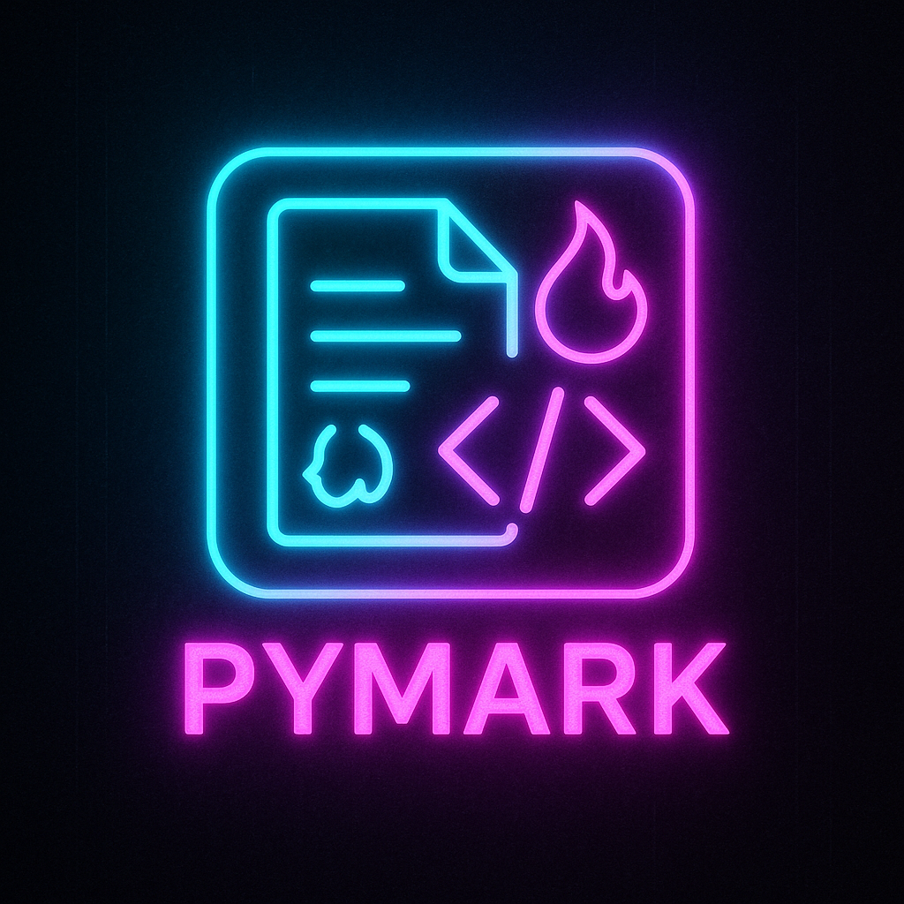

# Pymark

<p align="center">
  
</p>

**Pymark** is a modern Markdown-to-PDF conversion tool featuring both a powerful CLI and an elegant web interface. Write, preview, and export your Markdown documents with ease.

## ✨ Features

### Web Interface
- **Split & Focus Modes** – Toggle between side-by-side editing/preview and distraction-free writing
- **Live Preview** – Instantly see rendered Markdown with syntax highlighting, tables, and more
- **Import Options** – Load Markdown from local `.md` files or fetch from remote URLs
- **Export Capabilities** – Download as `.md` or generate professional PDFs
- **Auto-Save** – Your work is automatically saved to browser storage
- **Modern UI** – Clean, responsive design with a polished gradient background

### Command-Line Interface
- Convert Markdown files to PDF with a single command
- Custom CSS styling support
- Configurable document titles
- Batch processing capability

## 🚀 Quick Start

### Installation

```bash
pip install -r requirements.txt
```

> **macOS users:** WeasyPrint requires system libraries. Install via Homebrew:
>
> ```bash
> brew install cairo pango gdk-pixbuf libffi
> ```

### Web Interface

Launch the web app:

```bash
python main.py --serve
```

Open your browser to `http://127.0.0.1:5000` and start writing!

**Web Features:**
- 📝 Write Markdown in the left pane
- 👁️ See live preview on the right
- 🔄 Toggle split/focus view from the top bar
- 📤 Upload `.md` files or load from URLs
- 💾 Download your work as Markdown
- 📄 Export to professionally styled PDFs

### CLI Usage

Convert a Markdown file to PDF:

```bash
python main.py input.md output.pdf
```

**Options:**

- `--css <file>` – Apply custom CSS stylesheet
- `--title "Title"` – Set PDF document title
- `--serve` – Launch web interface instead of CLI mode
- `--host <host>` – Web server host (default: 127.0.0.1)
- `--port <port>` – Web server port (default: 5000)

**Examples:**

```bash
# Basic conversion
python main.py README.md README.pdf

# With custom styling
python main.py notes.md notes.pdf --css custom.css --title "My Notes"

# Auto-generate output name
python main.py document.md
# Creates document.pdf
```

## 🛠️ Tech Stack

- **Backend:** Python, Flask, WeasyPrint, Markdown
- **Frontend:** Vanilla JavaScript, Marked.js, DOMPurify
- **Styling:** Modern CSS with Space Grotesk font

## 📦 Project Structure

```
pymark/
├── main.py              # Core application (CLI + Flask server)
├── requirements.txt     # Python dependencies
├── static/
│   ├── index.html      # Web UI structure
│   ├── styles.css      # Modern UI styling
│   └── app.js          # Frontend logic
├── README.md           # This file
└── LICENSE             # MIT License
```

## 📝 Notes

- The web interface stores drafts in browser localStorage
- Images referenced in Markdown are resolved relative to the source file
- Built-in PDF styling follows professional document standards
- Remote URL imports are limited to 1 MB for safety
- Both HTTP and HTTPS URLs are supported for imports

## 🤝 Contributing

Contributions welcome! Feel free to open issues or submit pull requests.

## 📄 License

MIT License – see [LICENSE](LICENSE) for details.

---

**Made with ❤️ using Python and modern web technologies**
